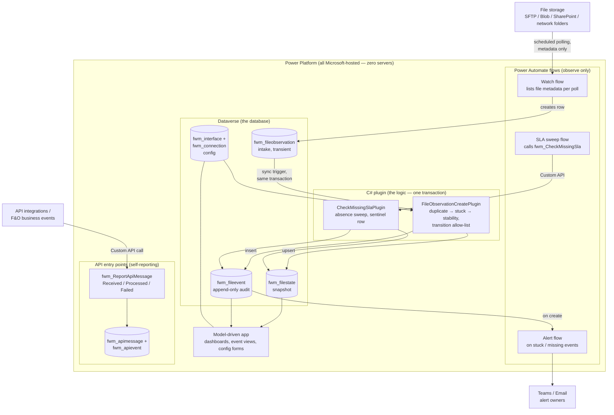

# How the D365-native File Watcher works

Plain-language runtime walkthrough. Normative details live in the
[design spec](superpowers/specs/2026-07-17-d365-native-architecture-design.md);
this document explains the moving parts and one file's journey through them.

## The alignment (what runs where)

| Concern | Where it lives | Who hosts it |
|---|---|---|
| Database | 5 Dataverse tables | Microsoft (Dataverse) |
| Business logic | C# plugin in Dataverse's sandbox workers | Microsoft (Dataverse) |
| File watching | Power Automate cloud flows (native connectors) | Microsoft (Power Platform) |
| Config + monitoring UI | Model-driven Power App | Microsoft (Power Platform) |
| Alerts | Flow on event-create → Teams/email | Microsoft (Power Platform) |

**Zero servers.** No VM, no Azure subscription, no Node hosting, no containers. The client's
footprint is the D365 F&O environment they already own (its linked Dataverse environment is
where everything installs) plus Power Apps licensing. Only exception: watching on-prem
network folders needs the free on-premises data gateway install; SFTP/Blob/SharePoint need
nothing.

**F&O's role:** consumer, not runtime. Every F&O environment has a linked Dataverse
environment (PPAC shows both under one environment; F&O answers on
`*.operations.dynamics.com`, Dataverse on `*.crm.dynamics.com`). Our solution lives entirely
on the Dataverse side — F&O needs zero changes, no X++. Events are visible to F&O via the
linked Dataverse, or optionally copied into an F&O data entity with one extra flow step
(standard Fin & Ops connector).

## The seven tables

1. **`fwm_connection`** — where files live (SFTP host, Blob account, SharePoint site).
   Metadata only. Credentials are never stored in any table — they live in Power Automate
   **connection references**, managed in the maker portal.
2. **`fwm_interface`** — what to watch, per feed: inbound path, file pattern, poll interval,
   stability window, stuck threshold, SLA deadline (`"08:00"` UTC). Example: *SA-034 Vendor
   Invoices — watch `/ag-doc/vendor-invoice/inbound/`, expect a file daily by 08:00*.
3. **`fwm_fileobservation`** — intake. One row = "a flow saw file X, size Y, modified Z, at
   time T". Transient; purged by a bulk-delete job.
4. **`fwm_filestate`** — the current lifecycle state per file: current + previous status,
   batch id, timestamps. A snapshot, not a history log. Unique alternate key on
   (interface id, file path).
5. **`fwm_fileevent`** — append-only audit trail. Every meaningful status change is one row,
   written in the same transaction as the state change.
6. **`fwm_apimessage`** — API entry-point message state (self-reported — see the "second
   rule pack" section below). A message has identity, so it is its own state row;
   `__heartbeat__` is the feed-SLA sentinel.
7. **`fwm_apievent`** — append-only audit trail for API message lifecycle events.

## Runtime walkthrough

### Step 1 — Watch flow observes (no logic)

A scheduled Power Automate flow (one per connection) wakes every N minutes, lists files via
the native connector (SFTP-SSH / Azure Blob / SharePoint / File System), filters by the
interface's path + pattern, and creates one `fwm_fileobservation` row per file — path, size,
source modified time. That is the flow's entire job: **flows observe, the engine decides**.
Flows never read file contents, never move or delete anything.

### Step 2 — Plugin decides (the brain, one transaction)

Dataverse fires our C# plugin synchronously, **inside the same database transaction** as the
observation insert. The plugin:

1. loads the `fwm_interface` config row,
2. loads existing `fwm_filestate` for (interface, path),
3. runs the rule pipeline — **duplicate → stuck → stability** — first match wins; no prior
   state and no rule fired means a brand-new file → `FILE_DETECTED`,
4. validates the proposed transition against the allow-list (anything not explicitly allowed
   throws, rolling back the whole transaction — nothing half-written),
5. upserts `fwm_filestate` and inserts `fwm_fileevent` — atomically.

One `batch_id` is generated when a file is first detected and reused for that file's whole
lifecycle, tying its events together.

### Step 3 — A file's timeline (example)

`VendorInvoice_20260717.xlsx` starts uploading at 06:00; stability window 30s:

| Poll | What the engine sees | Result |
|---|---|---|
| 06:01 | no prior state | `FILE_DETECTED`, batch `b-123` |
| 06:02 | size still growing | no event (re-observed, nothing meaningful) |
| 06:03 | size unchanged ≥ 30s | `FILE_STABLE`, same batch `b-123` |
| 06:10 | file re-appears after prior terminal status | `FILE_DUPLICATE`, same batch `b-123` |

A file that keeps changing past the stuck threshold gets `FILE_STUCK` (and can still recover
to `FILE_STABLE` later — the allow-list permits exactly that).

### Step 4 — SLA sweep catches absence

Files that never arrive produce no observations, so a separate scheduled flow calls Custom
API **`fwm_CheckMissingSla`** per enabled interface. If the deadline has passed and nothing
arrived today (UTC), the plugin writes one `FILE_MISSING_BY_SLA` event. A sentinel state row
(`__sla_window__`) makes re-runs idempotent — one alert per missed day, never spam, and it
re-fires on the next missed day.

### Step 5 — Humans see it

- **Alert flow** triggers on `fwm_fileevent` create for `FILE_STUCK` / `FILE_MISSING_BY_SLA`
  → Teams/email to the interface's alert owner.
- **Model-driven app** shows dashboards (stuck files, missing SLA today, duplicates) and the
  full per-batch event history; ops staff configure new interfaces in the same app — a form,
  not a deployment.

## API entry points — the second rule pack

Interfaces that enter through APIs (OData/custom services, async messages) don't need
watching — they already touch D365 when they run, so they **self-report** into the same
monitor: the integration (or an F&O business-event flow) calls Custom API
`fwm_ReportApiMessage` with `Received` / `Processed` / `Failed`. Same engine skeleton,
same transaction guarantee, own statuses (`MSG_RECEIVED`, `MSG_PROCESSED`,
`MSG_DUPLICATE`, `MSG_FAILED`, `MSG_TIMEOUT`) in `fwm_apimessage` +
append-only `fwm_apievent`. A sweep (`fwm_CheckApiSla`) adds what self-reporting can't:
timeouts (received but never processed) and the feed heartbeat (`FEED_MISSING_BY_SLA` —
nothing arrived today, sentinel-idempotent like the file SLA). Files are *watched*
because they can't speak; APIs *report* because they can. One monitor, two rule packs.
Details: [API entry-point monitoring spec](superpowers/specs/2026-07-22-api-entrypoint-monitoring-design.md).

## Why there is no Gateway / outbox / retry queue

The original external-services design needed an outbox because the event writer sat outside
D365 — the network could fail between "state updated" and "event delivered". With the writer
inside Dataverse's transaction, that failure mode is structurally impossible: observation,
state change, and event commit or roll back together. Roughly 40% of the originally planned
system (Gateway HTTP API, outbox, retry policy, dead-letter, delivery worker) disappeared by
relocating the logic rather than cutting features.

## How correctness is proven

- The original TypeScript engine (81 tests) is frozen as the **executable reference spec**.
- Test vectors are generated **by executing** that reference
  (`npm run parity:vectors -w @apps/watcher`); the C# engine must pass all 43 vector-driven
  parity tests (`d365/FileWatcherMonitoring.Plugins.Tests`).
- The Dataverse layer (repository upsert, plugin path, both sweeps, the API rule pack's
  transition policy/report handling) has 38 further tests against a fake
  `IOrganizationService` (`d365/FileWatcherMonitoring.Dataverse.Tests`).
- 8 python drift guards machine-check the provisioning script against `Schema.cs`.
- CI runs all suites plus a vector-drift check on every push — **170 checks total**.
